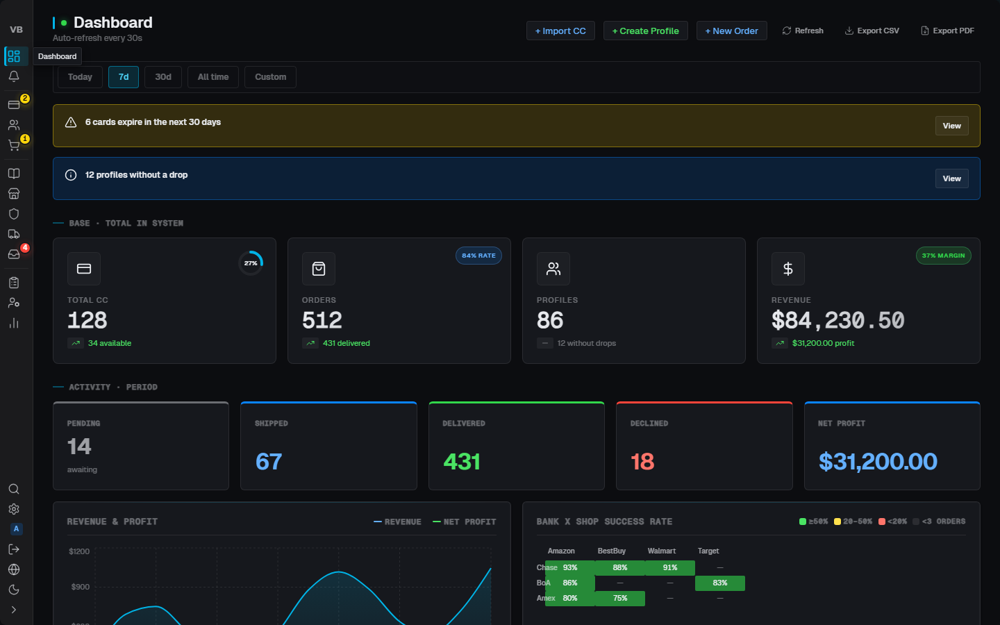
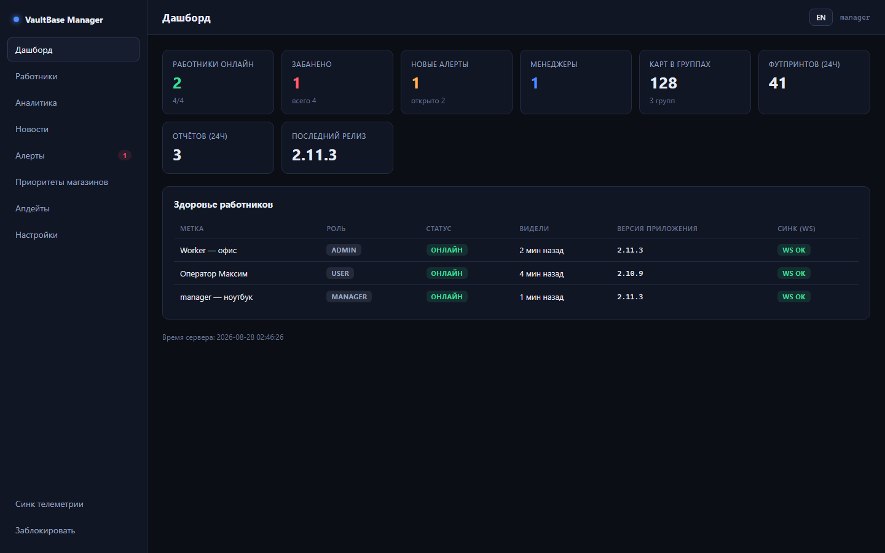
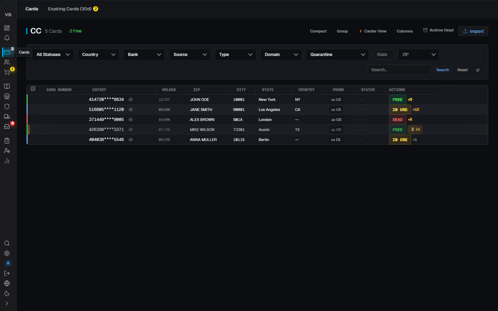
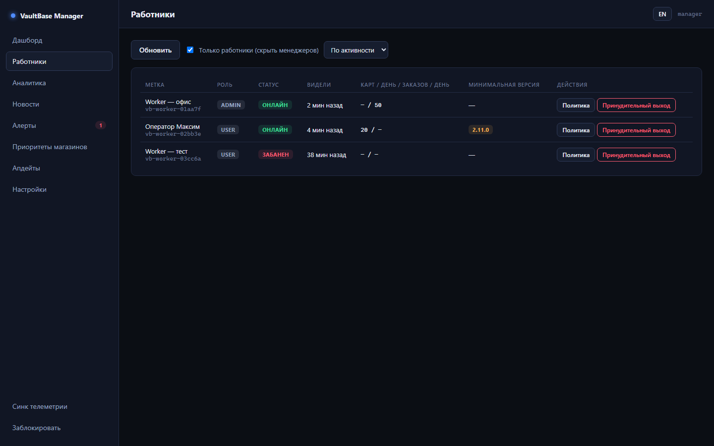
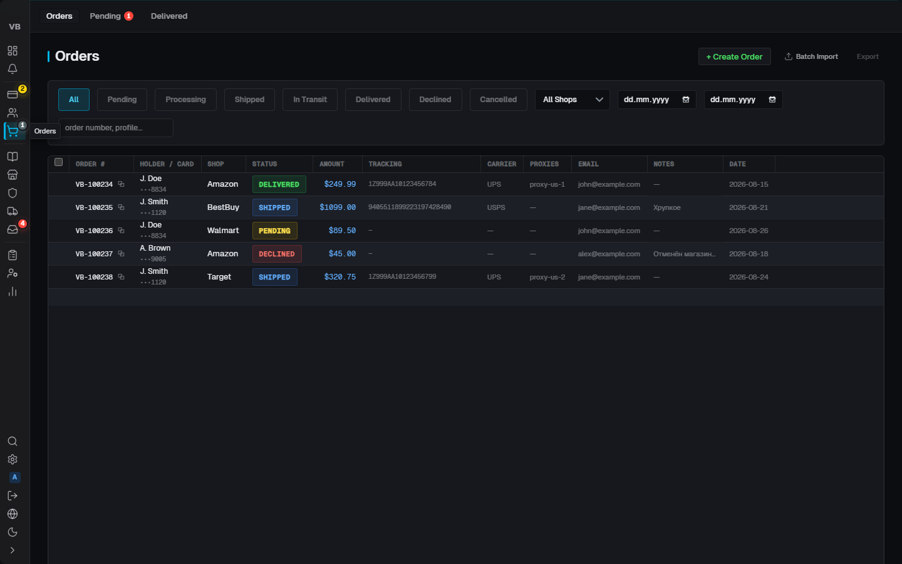
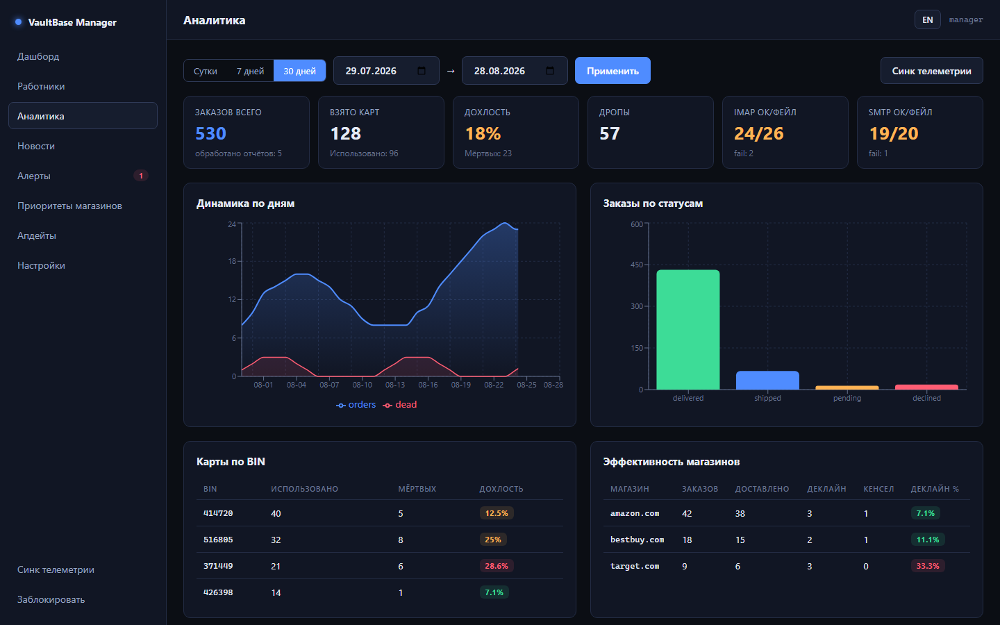
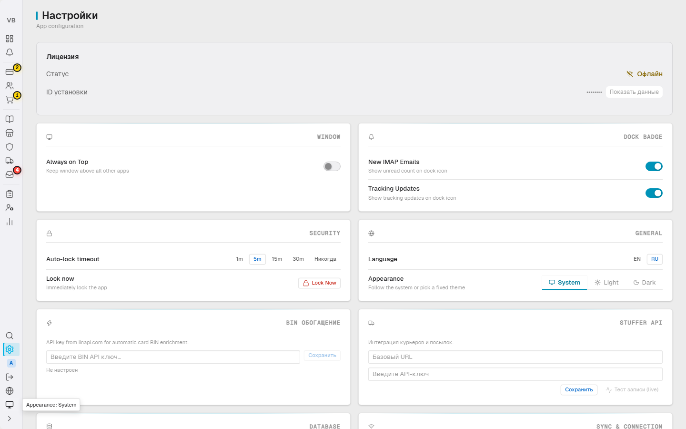
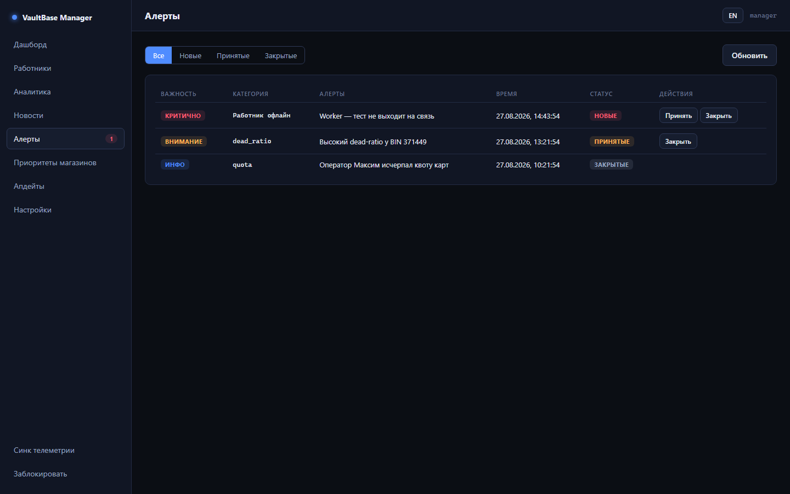

<div align="center">

# VaultBase

**Защищённый десктоп для управления картами, профилями, заказами, магазинами,
прокси и почтой — плюс второе приложение для менеджера команды.**


**[Скриншоты](#скриншоты)** ·
**[Два приложения](#два-приложения)** ·
**[Пул-модель карт](#пул-модель-карт)** ·
**[Телеметрия](#телеметрия-и-мониторинг)** ·
**[Карта разделов](#карта-разделов)** ·
**[Безопасность](#безопасность)** ·
**[Быстрый старт](#быстрый-старт)** ·
**[Документация](#документация)**

</div>

---

Локальная БД с полным шифрованием (SQLCipher), вход по лицензии + мастер-пароль
(PBKDF2 1 000 000 итераций), AES-256-GCM для чувствительных полей, E2E-шифрованная
синхронизация между устройствами через собственный sync-сервер. Два приложения в
одном репозитории: **воркер** (рабочее место оператора) и **VaultBase Manager**
(управление командой, пулом карт и политиками, мониторинг в реальном времени и
аналитика по воркерам / BIN / шопам / дропам).
Tauri-команд: 248 (воркер) + 19 (менеджер) · unit-тесты: 337 (JS) + 185 (Rust) ·
e2e: 8 спеков (chromium + firefox) · i18n: RU/EN, 1018 ключей на язык.

---

## Скриншоты

Все снимки генерируются автоматически — [`scripts/visual-audit.mjs`](scripts/visual-audit.mjs)
крутит оба приложения в Playwright с мок-данными и складывает снимки в репозиторий.
Полные наборы: **[воркер — 18 снимков](docs/screenshots/worker)** ·
**[менеджер — 15 экранов](docs/screenshots/manager)**.

| Воркер                                                                                                                                                                                          | VaultBase Manager                                                                                                                                                                         |
| ----------------------------------------------------------------------------------------------------------------------------------------------------------------------------------------------- | ----------------------------------------------------------------------------------------------------------------------------------------------------------------------------------------- |
| <a href="docs/screenshots/worker/nav-01-dashboard.png"></a><br>**Дашборд** — сводка, графики, heatmap | <a href="docs/screenshots/manager/04-dashboard.png"></a><br>**Дашборд** — команда и телеметрия   |
| <a href="docs/screenshots/worker/nav-03-cards.png"></a><br>**Карты** — импорт, фильтры, BIN                         | <a href="docs/screenshots/manager/05-workers.png"></a><br>**Работники** — политики, баны, квоты |
| <a href="docs/screenshots/worker/nav-05-orders.png"></a><br>**Заказы** — статусы, трекинги                        | <a href="docs/screenshots/manager/06-analytics.png"></a><br>**Аналитика** — BIN, шопы, дропы             |
| <a href="docs/screenshots/worker/nav-18-dark.png"></a><br>**Тёмная тема** и EN-локаль                          | <a href="docs/screenshots/manager/08-alerts.png"></a><br>**Алерты** — числовые правила                         |

---

<a name="два-приложения"></a>

## Два приложения

### 🖥 Воркер — рабочее место оператора

Карты, профили с дропами, заказы с трекингами, каталог, магазины с риск-скорингом,
пул прокси (включая PPTP-серверы uPanel), интеграция Stuffer API, IMAP-мониторинг
почты и SMTP-отправка, журнал активности, личная воронка дня на дашборде,
плавающее окно профиля поверх всех окон.
[Все снимки →](docs/screenshots/worker)

### 🛡 VaultBase Manager — управление командой

Дашборд с онлайн-статусами команды в реальном времени (heartbeat каждые 5 минут),
работники и политики (бан, пауза, force_logout, минимальная версия,
переопределение прав, дневные квоты, пресеты «новичок/проверенный/испытательный»),
vault карт с раздачей запечатанных срезов, аналитика по воркерам / BIN / шопам /
дропам за 1/7/30 дней, новости, алерты с числовыми правилами, приоритеты шопов,
лицензии (создание/отзыв прямо из приложения), staged rollout обновлений обоих
приложений. Подробно — в разделе [«Телеметрия и мониторинг»](#телеметрия-и-мониторинг).
Отчёты воркеров приходят «запечатанными конвертами»
(X25519 → HKDF → AES-256-GCM) — расшифровать их может только менеджер, сервер
хранит лишь ciphertext. [Все экраны →](docs/screenshots/manager)

---

## Пул-модель карт

Централизованный оборот карт: менеджер — единственный источник, воркер — приёмник.

- **Vault менеджера** — импорт карт (PAN существует только у менеджера),
  дубль-чек против реестра сожжённых, карт «на руках у воркера» и живого пула.
- **Запечатанная раздача** — персональные срезы пула шифруются под X25519-ключ
  конкретного воркера (`worker_keys`, регистрация при активации): сервер пересылает
  конверты, не видя содержимого.
- **Пул №2** — деклайнутые карты уезжают менеджеру со счётчиком и опциональной
  причиной (ручной ввод «почему» прямо из воркера).
- **Экспорт и зачистка** — выгрузка любого пула на ПК с последующей зачисткой
  и журналом вывозов; суточная сверка целостности пула, учёт занятости
  и «потеряшек».
- **Жёсткие границы воркера** — `can_add_cards=false`: воркер не создаёт карты,
  а только меняет статусы существующих; группы и pair-коды погашены.
- **Пауза воркера** — новые срезы не выдаются, закреплённое остаётся; менеджер
  может забрать карты обратно в пул или выгрузить их.
- **Жизненный цикл ключей** — бан воркера отзывает срез, restore перевыпускает
  ключ; аудит всех раздач и экспортов.
- **Атрибуция** — каждый заказ и смена статуса карты записывают автора
  (`orders.created_by`, `order_status_history`, `card_status_events`):
  time-in-status и история деклайнов считаются без парсинга логов.

---

## Телеметрия и мониторинг

Сквозной контур наблюдения: **воркер собирает → сервер слепо пересылает →
менеджер расшифровывает, считает и действует**. Три потока данных: живые
heartbeat'ы (реальное время), суточные отчёты daily_stats (аналитика) и
событийная лента (алерты). Плюс обратный канал — политики и новости летят
воркерам мгновенно по WebSocket.

### ⏱ Реальное время — heartbeat каждые 5 минут

Каждый воркер каждые 5 минут шлёт запечатанный heartbeat. Менеджер видит команду
живьём, без «раз в сутки»:

- **Кто онлайн прямо сейчас** — статусы online / offline / banned / inactive
  по каждому воркеру и каждой установке, `last_seen` с точностью до минуты;
  воркер молчит >10 минут — серверный alerts-engine (тик 60 с) поднимает
  `worker_offline`, возврат в сеть автоматически закрывает алерт.
- **Здоровье каждой машины** — версия приложения и платформа, жива ли локальная
  БД, поднят ли WS-синк, **реальные пробы** IMAP / SMTP / прокси (TCP-коннект к
  SMTP-хосту, фактические отправки, счётчики ошибок), а не «галочка в конфиге».
- **Ошибки за 24 часа** — `errors_24h` с разбивкой по категориям
  (imap / smtp / proxy / sync / order / other): видно, у кого и что именно сыплется.
- **Дашборд менеджера** — health-сводка по всем воркерам, время сервера,
  состояние синка, открытые алерты — одним экраном.

### 📊 Аналитика — суточные отчёты daily_stats

Раз в сутки (00:05 локального времени + догоняющая отправка при старте, если
вчерашний отчёт не ушёл) воркер собирает из своей SQLite полный срез дня.
Менеджер складывает отчёты и строит разрезы:

| Разрез               | Что видно                                                                                                                                                                                          |
| -------------------- | -------------------------------------------------------------------------------------------------------------------------------------------------------------------------------------------------- |
| **По воркерам**      | Таблица команды: заказы, карты taken/used, declined, delivered, дропы, dead-ratio, ошибки за 24ч; сортировка по активности / имени / статусу; сплит `by_user` по операторам внутри одной установки |
| **По BIN**           | `cards.by_bin` — used/dead по каждому BIN: какие бины живут, какие выгорают; dead-ratio по BIN                                                                                                     |
| **По шопам**         | `shops.<domain>` — заказы, доставки, деклайны, отмены, **выручка** и decline-ratio по каждому магазину                                                                                             |
| **По дропам**        | `drops.by_destination` — куда и сколько дропов ушло, taken по направлениям                                                                                                                         |
| **По заказам**       | `orders.by_status` — воронка pending → shipped → delivered / declined / cancelled                                                                                                                  |
| **Здоровье каналов** | IMAP/SMTP/прокси ok/fail-счётчики за день, WS-синк (push_ok / push_fail)                                                                                                                           |
| **Пул карт**         | Снапшот состава пула: BIN / страна / возраст карт, прокси blocked/total                                                                                                                            |

Всё это — с переключателем периодов **1 / 7 / 30 дней**, графиками заказов по
дням, спарклайнами и дельтами к прошлому периоду. Пример payload'а отчёта:

```json
{
  "date": "2026-08-25",
  "payload_version": 2,
  "app_version": "2.11.3",
  "orders": { "total": 12, "by_status": { "delivered": 8, "declined": 2 } },
  "cards": { "taken": 15, "used": 11, "dead": 3, "by_bin": { "411111": { "used": 5, "dead": 1 } } },
  "drops": { "taken": 4, "by_destination": { "shop.example.com": 2 } },
  "shops": {
    "shop.example.com": {
      "orders": 6,
      "delivered": 4,
      "declined": 1,
      "cancelled": 0,
      "revenue": 830.0
    }
  },
  "health": { "imap_ok": 140, "imap_fail": 2, "smtp_ok": 9, "proxy_ok": 33 },
  "sync": { "ws_ok": true, "push_ok": 61, "push_fail": 0 }
}
```

### 🚨 Алерты — числовые правила, а не «посмотрите в логи»

Движок правил в самом менеджере (`alerts.rs`, тик 60 с) считает алерты локально
по расшифрованным отчётам — без серверной логики и без Telegram:

- **Спайк деклайнов** — порог по decline-ratio, эскалация в critical при ≥70%;
- **Доля мёртвых карт** — dead-ratio по воркеру / BIN;
- **Достижение дневных квот** — воркер уперся в лимит карт/заказов;
- **Offline-детектор** — воркер молчит >10 минут (по heartbeat).

У алертов дедупликация по эпизодам (один спайк = один алерт, а не сто),
статусы ack/close, severity, OS-уведомления при активной сессии, опциональный
HTTPS-webhook пачкой новых алертов и **диплинки**: клик по алерту открывает
нужный раздел с нужным воркером.

### 🧠 Умный слой менеджера

- **Инсайты на русском** — «у воркера X выросла доля деклайнов по BIN 411111»,
  ранжированные по объёмному влиянию, а не список сырых чисел.
- **«Действия дня»** — карточка = кнопка: инсайт сразу ведёт к действию
  (поставить на паузу, сменить квоту, открыть политику).
- **Score воркеров + адаптивные квоты** — рекомендации по квотам с
  human-in-the-loop: менеджер подтверждает, система применяет.
- **Dual-baseline аномалии** — воркер сравнивается и со средним по флоту,
  и с самим собой за 7 дней: ловит и «слабее всех», и «внезапно хуже обычного».
- **Прогноз выгорания пула** — темп расхода и dead-ratio → сколько пула осталось.
- **Дрейф версий** — кто на какой версии сидит, рассинхрон по команде.
- **Ночная сводка и недельные дайджесты** — по менеджерам и воркерам;
  месячные rollups у менеджера, ретенция конвертов на сервере.
- **Лента событий по работнику** — спайки деклайнов, мёртвые карты, падения
  IMAP/SMTP/прокси, чистые дни и их серии, тихие дни.

### 🔌 Надёжность канала

- **Офлайн-устойчивость** — неотправленные конверты складываются в локальный
  `telemetry_outbox` (FIFO, кап 500, дедуп по дате): неделя без сети не теряет
  статистику, очередь вымывается при первом успешном heartbeat.
- **Версионированный контракт** — `payload_version`, `worker_sent_at`,
  `tz_offset_min` (менеджер отображает время по МСК); golden-тесты и матрица
  совместимости «старый менеджер ↔ новый воркер», чтобы обновления не ломали
  сбор статистики.
- **Обратный канал по WS** — `policy_update` адресно конкретному воркеру и
  broadcast новостей: изменение политики менеджером доезжает до воркера
  за секунды, не дожидаясь heartbeat.

**Политики применяются воркером живьём:** бан → экран блокировки с причиной,
force_logout гасит все сессии установки, `update_required` → блокирующий экран
«Требуется обновление», permissions_override мёрджится поверх прав (явный `false`
режет даже админа), дневные квоты режут выдачу карт и создание заказов. Политика
персистится и действует после рестарта до первого heartbeat.

---

## Карта разделов

| Раздел                | Что делает                                                                                                                                                          | Код                                                            |
| --------------------- | ------------------------------------------------------------------------------------------------------------------------------------------------------------------- | -------------------------------------------------------------- |
| **Dashboard**         | Сводка: карты, заказы, выручка, алерты, графики, heatmap банк×магазин, личная воронка дня (взял → заказы → результат), аналитика по BIN/шопам/дропам, виджет uPanel | [`DashboardRedesigned.jsx`](src/pages/DashboardRedesigned.jsx) |
| **Updates**           | «Пока вы спали» — события из почты: новые треки, доставки, отмены                                                                                                   | [`Updates.jsx`](src/pages/Updates.jsx)                         |
| **Cards**             | База карт: фильтры и пресеты, статусы (free/in_use/dead), BIN-энричмент, авто-архив dead, причина деклайна                                                          | [`Cards.jsx`](src/pages/Cards.jsx)                             |
| **Profiles**          | Профили = карта + получатель + адрес. Дропы живут внутри профиля                                                                                                    | [`Profiles.jsx`](src/pages/Profiles.jsx)                       |
| **Orders**            | Заказы: статусы, трекинги, batch-импорт с прогрессом, повтор заказа, привязка посылок                                                                               | [`Orders.jsx`](src/pages/Orders.jsx)                           |
| **Catalog**           | Каталог товаров и магазинов-источников; колонка «Приоритет» и сортировка по весу менеджера                                                                          | [`Catalog.jsx`](src/pages/Catalog.jsx)                         |
| **Shops**             | Магазины: флаги риска (AVS/VPN/AMEX), win/loss, success rate, риск-скоринг v2 (магазин × карта × время × сумма)                                                     | [`Shops.jsx`](src/pages/Shops.jsx)                             |
| **Proxies**           | Вкладка PPTP (uPanel): живые серверы, фильтры, «взять», креды, заметки; пул прокси с проверкой живости                                                              | [`Proxies.jsx`](src/pages/Proxies.jsx)                         |
| **Couriers/Packages** | Интеграция со Stuffer API: курьеры и посылки, общие теги занятости через sync                                                                                       | [`Couriers.jsx`](src/pages/Couriers.jsx)                       |
| **IMAP**              | Почтовые аккаунты: мониторинг писем, парсинг треков/подтверждений, SMTP-отправка                                                                                    | [`Imap.jsx`](src/pages/Imap.jsx)                               |
| **Activity Log**      | Журнал всех действий в системе (аудит)                                                                                                                              | [`ActivityLog.jsx`](src/pages/ActivityLog.jsx)                 |
| **Settings**          | Лицензия, тема, язык, авто-блокировка, panic-пароль, BIN API, Stuffer API, БД, синк                                                                                 | [`Settings.jsx`](src/pages/Settings.jsx)                       |

Скрытые/служебные страницы: [`Login.jsx`](src/pages/Login.jsx) (мастер-пароль, экран
бана/блокировки), [`UserLogin.jsx`](src/pages/UserLogin.jsx), [`Activate.jsx`](src/pages/Activate.jsx)
(активация лицензии), [`Onboarding.jsx`](src/pages/Onboarding.jsx) и
[`float.jsx`](src/float.jsx) — отдельное плавающее окно профиля (`float.html`).
Управление пользователями и командная статистика вынесены в менеджер-приложение —
в воркере их нет ни у одной роли.

### Плавающее окно профиля (float)

Отдельное always-on-top окно с данными активного профиля:

- **Копи-чипы** — зип / адрес / фуллнейм / имя / фамилия / телефон отдельными
  кликабельными чипами; копирование через `copySensitive` с автоочисткой
  буфера, адрес — одной строкой или многострочно по выбору.
- **Быстрая замена** — карта под тот же зип+BIN, по штату или ближнему штату;
  курьер по зипу/штату из уже забронированного с автоподстановкой.
- **Вкладка Email/OTP** — последние письма с имейла профиля, автовычлененный
  код подтверждения и кнопка «копировать код».
- **Быстрый деклайн** — одна кнопка прямо из окна: причина необязательна, карта
  уезжает менеджеру в пул №2.
- **Мини-режим** — одна строка «номер • CVV • срок», запоминание позиции окна,
  глобальный хоткей показать/скрыть.
- Лейблы Fresh/Used/Burned и Safe/Warning/High Risk — через i18n (RU/EN).

---

## Быстрый старт

```bash
npm install            # зависимости
npm run dev            # Vite dev-сервер :5173 (UI без десктоп-обвязки)
npx tauri dev          # полное приложение (Rust + WebView)
npm run tauri build    # продакшн-инсталляторы -> src-tauri/target/release/bundle/
```

Менеджер — отдельное приложение в этом же репозитории: [`manager-app/`](manager-app/)
(свой `npm run dev`, свой Tauri-процесс и своя SQLCipher-база).

## Проверки и качество

| Проверка                    | Команда                            | Результат                    |
| --------------------------- | ---------------------------------- | ---------------------------- |
| ESLint                      | `npm run lint`                     | 0 ошибок                     |
| Unit-тесты (JS)             | `npx vitest run`                   | 337 passing                  |
| Unit-тесты (Rust)           | `cargo test` (в `src-tauri`)       | 185 passing                  |
| E2E (Playwright, мок Tauri) | `npm run test:e2e`                 | 8 спеков, chromium + firefox |
| Аудит дрейфа CSS/i18n       | `python scripts/audit_frontend.py` | 0 orphan / 0 phantom         |
| Visual-аудит всех страниц   | `node scripts/visual-audit.mjs`    | 33 снимка, 0 ошибок консоли  |

Дальше это гоняет CI: подпись автообновлений (minisign, отдельный ключ у
менеджера), production-профиль релизов, dependabot по npm/cargo/actions.

## Архитектура

```
VaultBase/
├── src/                  # Фронтенд воркера (React 18 + Vite)
│   ├── pages/            # Страницы — см. карту разделов выше
│   ├── components/       # Общие: Modal, EmptyState, ErrorBoundary, skeletons...
│   ├── store/            # Сторы (cards, orders) — кэш и состояние списков
│   ├── api/              # Тонкие обёртки над Tauri-командами
│   ├── hooks/            # useAuth, useLang, useKeyboardShortcuts, useUndo...
│   ├── i18n/             # en.js / ru.js — 1018 ключей, t(key, {params})
│   └── styles/           # 7 файлов: tokens.css, base, layout, components, pages
├── src-tauri/            # Бэкенд воркера (Rust)
│   └── src/
│       ├── commands/     # 248 Tauri-команд по доменам (cards, orders, imap, telemetry...)
│       ├── database/     # SQLite/SQLCipher: _cards, _orders, _analytics, _shops...
│       ├── encryption.rs # AES-256-GCM полей, обёртки ключей
│       ├── wipe.rs       # Panic-пароль: криптостирание через уничтожение DEK
│       └── sync.rs / ws_sync.rs  # HTTP + WebSocket синхронизация
├── manager-app/          # VaultBase Manager — второе приложение (React + Rust, 19 команд)
├── cc-sync-server/       # Собственный WebSocket sync-сервер (Node.js) + docs/API.md
├── e2e/                  # Playwright-тесты с моком Tauri (setup/tauri-mock.js)
├── scripts/              # audit_frontend.py, visual-audit.mjs, release-скрипты
└── docs/                 # Справочники: [индекс](docs/README.md)
```

**Поток данных:** `UI → Tauri-команда → Rust → SQLite (SQLCipher) → ответ → стор → мгновенный WS-пуш всем онлайн-устройствам группы`.

**Вход:** лицензия (challenge → activation key через sync-сервер) → мастер-пароль →
автовход в соло-режиме. Роль admin/operator приходит с лицензией и обновляется
при каждой верификации.

## Синхронизация в реальном времени

Все устройства группы держат постоянный WebSocket к sync-серверу. Любое действие
любого воркера мгновенно рассылается всем онлайн — без кнопки «обновить»:

- **Карта** — взял, отметил used / dead / **declined** / **cancelled**, вернул
  free, массовая смена статусов: событие `card_update` сразу применяется в
  локальную SQLite каждого онлайн-устройства и всплывает в UI. Статус карты
  летит открытым полем (для дедупа и фильтров), а PAN/CVV — внутри
  зашифрованного `encrypted_data` под ключ группы.
- **Каталог и шопы** — добавил товар или магазин → `catalog_update` upsert'ится
  у всех (item и shop раздельно), раздел каталога обновляется живьём.
- **Дропы и посылки** — теги занятости курьеров (`courier_tag`: «занят этот
  дроп/курьер») шарятся по группе, коллеги видят занятость сразу, без двойного
  бронирования.
- **Политики и новости** — `policy_update` адресно конкретному воркеру, новости
  broadcast'ом: бан, квота или объявление доезжают за секунды.

Если устройство офлайн — изменения не теряются: при переподключении приходит
`full_data` (полный снапшот) плюс пропущенные дельты, и локальная база
догоняется до актуального состояния. Сервер лишь роутит зашифрованные пакеты
между членами группы — расшифровать их может только тот, у кого есть ключ группы.

## Безопасность

Все данные приложения — карты, профили, дропы, заказы, шопы, прокси, пароли,
история — лежат в **одном зашифрованном контейнере на диске**. По сути это как
**VeraCrypt-контейнер**: пока не введён мастер-пароль, на диске только плотный
шифротекст — ни таблиц, ни названий колонок, ни одной строки в открытом виде.
Ввёл пароль — контейнер «примонтирован» и приложение работает; заблокировал —
контейнер «отмонтирован», и от содержимого не остаётся ничего читаемого.
Реализация — SQLite поверх SQLCipher: шифруется целиком весь файл базы,
каждая страница, а не отдельные колонки.

### Ключи — как всё открывается и закрывается

- Из мастер-пароля через **PBKDF2-SHA256, 1 000 000 итераций**
  (OWASP high-security) выводится **KEK** — «ключ от ключа».
- KEK отпирает **sidecar-конверт**, внутри которого лежит **DEK** — сам ключ
  базы. DEK никогда не хранится голым на диске и не выводится из пароля напрямую:
  можно менять мастер-пароль, не перешифровывая гигабайты данных.
- DEK живёт только в оперативной памяти на время сессии и **зануляется
  (zeroize) при блокировке**. Пароль и ключи нигде не сохраняются, не пишутся
  в логи и не уходят по сети.

Поверх шифрованного контейнера самые чувствительные поля (PAN, CVV, пароли,
токены) шифруются **ещё раз, отдельно — AES-256-GCM**: даже примонтировав базу,
без полевого ключа номер карты не прочитать. Двойной слой: украли файл базы —
получили шифротекст; каким-то образом сняли ключ контейнера — поля всё равно
под вторым слоем.

### Panic-пароль — «стереть под принуждением»

На экране разблокировки можно ввести **отдельный panic-пароль**. Приложение
ведёт себя так, будто пароль просто неверный — без ошибок, логов и следов, —
но при этом **необратимо криптостирает** данные: уничтожает DEK в sidecar и
перезаписывает файлы БД случайными байтами. Контейнер превращается в мусор,
восстановлению не подлежит.

**Доступ и сессии**

- Авто-блокировка по неактивности + баннер с обратным отсчётом за 2 минуты.
- Гранулярные права (`models::perms`) проверяются дважды: на бэкенде
  (`require_perm`) и на фронте (`hasPerm`); rate limiting (token bucket)
  на чувствительных командах.
- Первый admin создаётся со случайным 32-байтным паролем, который нигде
  не сохраняется.
- Revealed PAN/CVV в UI живут с TTL 5 минут и прячутся автоматически.

**Сеть и синхронизация**

- Sync-трафик шифруется сквозным шифрованием (ключ группы есть только у
  участников); телеметрия — «запечатанными конвертами»
  X25519 → HKDF → AES-256-GCM, сервер хранит только ciphertext.
- Менеджер никогда не получает ключи групп карт и PAN — только агрегаты;
  менеджерская лицензия не пускается в WS card-sync.
- На сервере токены лицензий и user_token хранятся только как SHA-256;
  kill-switch деплоя глушит воркерские каналы; WS-аутентификация защищена
  одноразовым nonce. Бэкапы серверной БД осознанно не делаются (вторая копия
  = риск компрометации).
- Бан воркера режет ВСЕ каналы разом: REST, WS и телеметрию (`403 banned`
  с причиной).

**Приложение**

- Строгий CSP: `script-src 'self'`, `object-src 'none'`, `frame-ancestors 'none'`,
  `upgrade-insecure-requests` + report-uri; `dangerouslySetInnerHTML` в коде
  отсутствует ([разбор](docs/CSP_SECURITY_NOTE.md)).
- Автообновления подписаны (minisign); staged rollout с каналами stable/beta
  и детерминированным бакетированием по installation_id.
- Полный аудит действий: локальный `activity_log` воркера и `manager_*`-события
  на сервере.

### Модель угроз — честно, что выдержит, а что нет

VaultBase защищает **данные в покое и в канале**. Вот реальная граница защиты.

**Украли/изъяли диск, приложение заблокировано — не разберут.**
SQLCipher 4 шифрует весь файл базы (AES-256-CBC страницами + HMAC-SHA512, ключ
256 бит, свой PBKDF2 256 000 итераций на открытие) и собран из исходников вместе
с OpenSSL (`bundled-sqlcipher-vendored-openssl` — не зависим от системных
библиотек). Плюс полевой AES-256-GCM. Брутфорс мастер-пароля упирается в два
каскада: 1 000 000 итераций, чтобы подобрать KEK, и 256 000 на каждую проверку
кандидата при открытии базы. Без пароля это шифротекст.

**Перехватили трафик или вскрыли sync-сервер — не разберут.**
Sync-трафик и телеметрия зашифрованы сквозным шифрованием (E2E); сервер хранит
и ретранслирует только ciphertext и не имеет ни ключей групп, ни PAN. Даже полный
дамп серверной БД не даёт ни одной карты.

**Сработал panic-пароль или удалённый wipe от менеджера — не восстановить.**
Гарантия необратимости — потеря DEK: sidecar с ключом перезаписывается случайными
байтами и удаляется вместе с файлами БД. Удалённый wipe одноразовый: воркер
подтверждает `wipe_ack` до стирания (после него токен и БД мертвы) — повторного
срабатывания не будет. Попыток восстановить DEK не существует по построению.

**Чего защита НЕ покрывает — важно понимать:**

- **Живая разблокированная сессия.** Пока приложение открыто, DEK лежит в
  оперативной памяти. Ключ можно снять дампом RAM (cold-boot, hibernation-файл,
  pagefile) или чтением памяти процесса. Поэтому есть авто-блокировка по
  неактивности и zeroize при локе — но окно, пока сессия жива, остаётся.
- **Скопом открытая сессия + live-система.** Если забрали работающую
  разблокированную машину — контейнер «примонтирован», защита в покое не
  действует. Здесь работают блокировка, TTL на PAN/CVV и panic-пароль.
- **Отсутствие правдоподобного отрицания (plausible deniability).** Файл
  шифротекста идентифицируем как зашифрованная БД: заголовок не маскируется,
  второго (ложного) профиля нет. Если требуется отрицаемость, контейнер надо
  дополнительно класть внутрь VeraCrypt/скрытого тома — сам VaultBase этого
  не имитирует.
- **Аппаратная/физическая компрометация.** Keylogger, прошивка, физический
  доступ к открытой сессии — вне модели угроз приложения.

**Итог:** против изъятия диска, перехвата канала, вскрытия сервера и против
принудительного стирания (panic/remote wipe) защита сильная и необратимая.
Против живой разблокированной сессии и отрицания наличия контейнера — нет,
и это честная граница любого решения без аппаратного модуля (TPM/Secure
Enclave).

### Форензика: какие следы остаются на машине

Даже если базу не вскрыть, по зацепкам вокруг неё видно само факт-использование
и характер работы. Честная карта следов — что стирается, а что остаётся.

**Что покрывает panic/remote wipe** (перезапись случайными байтами + удаление):
сама БД (`vaultbase.db`), её `-wal`/`-shm`, sidecar с DEK (`.salt` и `.salt.bak`),
`*.plaintext.bak`. После wipe содержимое базы не восстановить.

**Что НЕ покрывает wipe — и это надо знать:**

- **Автобэкапы** — `%LOCALAPPDATA%\vaultbase\backups\` хранит до **30 копий** базы
  (`backup_YYYYMMDD_HHMMSS.db`, ротация по 30 штук). В проде они зашифрованы тем же
  ключом, что и база (это копии шифротекста), но wipe их не трогает: это
  дополнительный шифротекст под перебор и доказательство длительной работы
  (даты в именах файлов). Полное стирание = wipe + удаление `backups\`.
- **Логи** — `%LOCALAPPDATA%\vaultbase\logs\vaultbase.log.YYYY-MM-DD`, открытый
  JSON **без ротации по сроку**: метки времени сессий, события уровня Info/Debug,
  абсолютные пути (в них — имя пользователя Windows). Контента карт в логах нет,
  но хронология активности читается целиком.
- **WebView2-кэш** — `%LOCALAPPDATA%\com.vaultbase.app\EBWebView`. Приложение при
  старте чистит его HTTP-кэш (все данные живут в SQLite, не в localStorage/IndexedDB),
  но сама папка и структура профиля — артефакт «приложение было установлено
  и запускалось».
- **Конфиги** — `VaultBase.<profile>.toml` рядом с exe: профиль, адрес sync-сервера,
  интервалы, уровень логирования. Секретов нет, но раскрывают инфраструктуру
  (куда ходит приложение).
- **Служебные файлы** — `.build_version`, `vaultbase.db.salt` с предсказуемым
  именем рядом с базой.

**Уровень ОС — вне контроля приложения, чистится только системными средствами:**
Prefetch, Amcache, Jump Lists, Recent Items, USN Journal, реестр (uninstall-записи),
индекс Windows Search, pagefile/hibernation (могут содержать DEK из живой сессии),
DNS-кэш и логи фаервола. Установщик и сам факт `com.vaultbase.app` в системе
удалением папки не стираются.

**Сетевой уровень — что видит наблюдатель, не вскрывая шифр:**
TLS скрывает содержимое, но не адресата: соединения с IP/доменом sync-сервера,
тайминги и размеры пакетов (heartbeat каждые 5 минут — характерный паттерн).
Сервер знает installation_id, IP и расписание подключений — метаданные, не
контент. Sentry crash-репорты (minidump'ы) — опция, по умолчанию выключены
(пустой DSN = ничего не отправляется).

**Практический вывод.** От «разобрать базу» — защита полная. От «доказать, что
работали и когда» — только частичная: максимальный режим — это panic/wipe +
удаление `backups\`, `logs\`, `EBWebView`, конфигов, либо весь
`%LOCALAPPDATA%\vaultbase` и инсталляция внутри VeraCrypt-контейнера (закрывает
и ОС-следы, и отрицание наличия).

- Автообновления подписаны (minisign); staged rollout с каналами stable/beta
  и детерминированным бакетированием по installation_id.
- Полный аудит действий: локальный `activity_log` воркера и `manager_*`-события
  на сервере.

## Конфигурация

Профили `VaultBase.dev.toml` / `.staging.toml` / `.production.toml` — порты,
sync-сервер, логирование. Подробно: [docs/CONFIGURATION.md](docs/CONFIGURATION.md),
[docs/CONSTANTS.md](docs/CONSTANTS.md).

## Документация

| Документ                                              | Что внутри                                         |
| ----------------------------------------------------- | -------------------------------------------------- |
| [AGENTS.md](AGENTS.md) / [AGENTS.ru.md](AGENTS.ru.md) | Правила разработки и для ИИ-агентов (EN/RU)        |
| [MASTER_CHECKLIST.md](MASTER_CHECKLIST.md)            | Живой чеклист задач — 183 пункта со статусами      |
| [PARALLEL_WORK.md](PARALLEL_WORK.md)                  | Протокол параллельных агентских сессий (worktrees) |
| [CHANGELOG.md](CHANGELOG.md)                          | История версий + [Unreleased]: сводка спринта      |
| [docs/README.md](docs/README.md)                      | Индекс всех справочников                           |
| [MANAGER_APP.md](docs/MANAGER_APP.md)                 | Архитектура VaultBase Manager и телеметрии         |
| [DESIGN_SYSTEM.md](docs/DESIGN_SYSTEM.md)             | Дизайн-система: токены, темы, типографика          |
| [UI_PAGES.md](docs/UI_PAGES.md)                       | Разметка и лейаут каждой страницы                  |

---

<div align="center">

**VaultBase** · проприетарная лицензия — все права защищены

Tauri 2 · Rust · React 18 · SQLite/SQLCipher · Node.js sync-сервер

</div>
