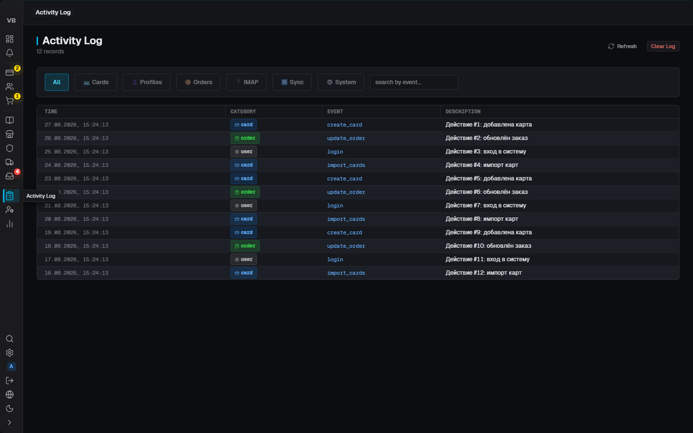

# VaultBase

**Версия:** 2.11.3 · **Стек:** Tauri 2 + React 18 + Rust + SQLite (SQLCipher)

Защищённое десктоп-приложение для управления картами, профилями, заказами, магазинами,
прокси и почтой. Локальная БД с полным шифрованием, вход по лицензии + мастер-пароль,
опциональная синхронизация между устройствами через свой sync-сервер.

---

## Что внутри (карта разделов)

| Раздел                | Что делает                                                                       | Код                                 |
| --------------------- | -------------------------------------------------------------------------------- | ----------------------------------- |
| **Dashboard**         | Сводка: карты, заказы, выручка, алерты, графики, heatmap банк×магазин            | `src/pages/DashboardRedesigned.jsx` |
| **Updates**           | «Пока вы спали» — события из почты: новые треки, доставки, отмены                | `src/pages/Updates.jsx`             |
| **Cards**             | База карт: импорт, фильтры, статусы (free/in_use/dead), BIN-энричмент, экспорт   | `src/pages/Cards.jsx`               |
| **Profiles**          | Профили = карта + получатель + адрес. Дропы живут внутри профиля                 | `src/pages/Profiles.jsx`            |
| **Orders**            | Заказы: статусы, трекинги, batch-импорт, повтор заказа                           | `src/pages/Orders.jsx`              |
| **Catalog**           | Каталог товаров и магазинов-источников (заполняется при синхронизации)           | `src/pages/Catalog.jsx`             |
| **Shops**             | Магазины: флаги риска (AVS/VPN/AMEX), win/loss, success rate, risk-скоринг       | `src/pages/Shops.jsx`               |
| **Proxies**           | Пул прокси: проверка живости, привязка к магазинам, статистика использования     | `src/pages/Proxies.jsx`             |
| **Couriers/Packages** | Интеграция со Stuffer API: курьеры и посылки                                     | `src/pages/Couriers.jsx`            |
| **IMAP**              | Почтовые аккаунты: мониторинг писем, парсинг треков/подтверждений, SMTP-отправка | `src/pages/Imap.jsx`                |
| **Activity Log**      | Журнал всех действий в системе (аудит)                                           | `src/pages/ActivityLog.jsx`         |
| **Users**             | (admin) Пользователи, роли, сессии, статистика команды                           | `src/pages/UsersPage.jsx`           |
| **My Stats**          | (operator) Личная статистика оператора                                           | `src/pages/MyStats.jsx`             |
| **Settings**          | Лицензия, тема, язык, авто-блокировка, BIN API, Stuffer API, БД, синк            | `src/pages/Settings.jsx`            |

Скрытые/служебные: `Login.jsx` (мастер-пароль), `UserLogin.jsx`, `Activate.jsx`
(активация лицензии), `Onboarding.jsx`, `Drops.jsx` (заглушка — функционал в Profiles),
`float.jsx` (отдельное плавающее окно профиля, `float.html`).

---

## Скриншоты

Снимки всех страниц генерируются автоматически скриптом `scripts/visual-audit.mjs` (Playwright + мок Tauri-команд, 0 ошибок консоли). Полные наборы лежат в репозитории: [`docs/screenshots/worker/`](docs/screenshots/worker) — 19 страниц воркера, [`docs/screenshots/manager/`](docs/screenshots/manager) — 14 экранов VaultBase Manager.

| Воркер                                                                                          | VaultBase Manager                                                                          |
| ----------------------------------------------------------------------------------------------- | ------------------------------------------------------------------------------------------ |
|       |   |
|                     |  |
|                   |           |
|  |                 |

---

## Как устроено

```
manager-work/
├── src/                  # Фронтенд React + Vite
│   ├── pages/            # Страницы (см. таблицу выше)
│   ├── components/       # Общие: Modal, EmptyState, ErrorBoundary, skeletons…
│   ├── store/            # Сторы (cards, orders) — кэш и состояние списков
│   ├── api/              # Тонкие обёртки над Tauri-командами
│   ├── hooks/            # useAuth, useLang, useKeyboardShortcuts, useUndo…
│   ├── i18n/             # en.js / ru.js — 530+ ключей, t(key, {params})
│   ├── styles/           # tokens.css (дизайн-токены), components.css, pages.css…
│   └── utils/            # clipboard, csv, validation, errorHandler…
├── src-tauri/            # Бэкенд Rust
│   └── src/
│       ├── commands/     # 206 Tauri-команд (IPC API фронта)
│       ├── database/     # SQLite: _analytics, _cards, _orders, _shops, _imap…
│       └── main.rs       # Точка входа, инициализация БД и конфига
├── cc-sync-server/       # Свой WebSocket sync-сервер (Node.js) + docs/API.md
├── e2e/                  # Playwright-тесты с моком Tauri (setup/tauri-mock.js)
├── scripts/              # audit_frontend.py (аудит дрейфа CSS/i18n), release-скрипты
└── docs/                 # Справочная документация (см. docs/README.md)
```

**Поток данных:** `UI → Tauri-команда → Rust → SQLite (SQLCipher) → ответ → стор/стейт`.
Шифрование: SQLCipher (вся БД), AES-256-GCM для полей, PBKDF2 600k для ключа из
мастер-пароля. Ключи живут только в памяти и зануляются при блокировке.

**Вход:** лицензия (challenge → activation key через sync-сервер) → мастер-пароль →
автовход (соло-режим). Роль admin/operator приходит с лицензией.

---

## Запуск

```bash
npm install            # зависимости
npm run dev            # Vite dev-сервер на :5173 (UI без десктоп-обвязки)
npx tauri dev          # полное приложение (Rust + WebView), собирает src-tauri
```

Продакшн: `npm run tauri build` → инсталляторы в `src-tauri/target/release/bundle/`.

## Проверки

```bash
npm run lint           # ESLint
npx vitest run         # 327 unit-тестов
npm run test:e2e       # Playwright e2e (с моком Tauri)
python scripts/audit_frontend.py   # аудит дрейфа: сиротские классы, фантомные токены, i18n
node scripts/visual-audit.mjs      # скриншоты всех страниц с мок-данными в audit-shots/
```

## Конфигурация

`VaultBase.dev.toml` / `.staging.toml` / `.production.toml` — профили (порты, sync-сервер,
логирование). Подробно: [docs/CONFIGURATION.md](docs/CONFIGURATION.md) и
[docs/CONSTANTS.md](docs/CONSTANTS.md).

## Документация

- [AGENTS.ru.md](AGENTS.ru.md) — правила для разработки (и для ИИ-агентов)
- [MASTER_CHECKLIST.md](MASTER_CHECKLIST.md) — живой чеклист задач (184 пункта)
- [PARALLEL_WORK.md](PARALLEL_WORK.md) — протокол параллельной работы агентских сессий
- [CHANGELOG.md](CHANGELOG.md) — история версий
- [docs/README.md](docs/README.md) — индекс всех справочников

## Лицензия

Проприетарная — все права защищены.
